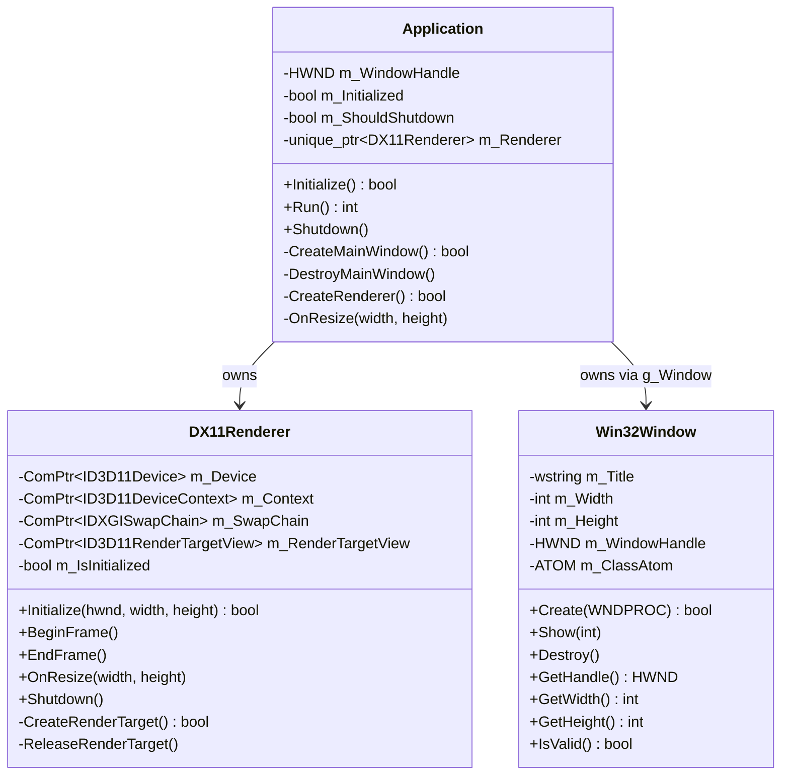

# Data Model: DX11 Render Bootstrap

**Date**: 2026-03-10
**Spec**: [spec.md](spec.md)
**Research**: [research.md](research.md)

## Entity Overview



## DX11Renderer Class

**Location**: `LXEngine/Src/Renderer/DX11Renderer.h` + `.cpp`
**Namespace**: `LongXi`

### Members

| Name               | Type                             | Purpose                                             | Naming Convention |
| ------------------ | -------------------------------- | --------------------------------------------------- | ----------------- |
| m_Device           | `ComPtr<ID3D11Device>`           | GPU interface for resource creation                 | m_PascalCase      |
| m_Context          | `ComPtr<ID3D11DeviceContext>`    | Immediate context for rendering commands            | m_PascalCase      |
| m_SwapChain        | `ComPtr<IDXGISwapChain>`         | Presents rendered frames to window                  | m_PascalCase      |
| m_RenderTargetView | `ComPtr<ID3D11RenderTargetView>` | Render target bound each frame for clearing         | m_PascalCase      |
| m_IsInitialized    | `bool`                           | Guards against operations on uninitialized renderer | m_PascalCase      |

### Methods

| Method              | Signature                                           | Purpose                                                              |
| ------------------- | --------------------------------------------------- | -------------------------------------------------------------------- |
| Initialize          | `bool Initialize(HWND hwnd, int width, int height)` | Creates device, swap chain, render target. Returns false on failure. |
| BeginFrame          | `void BeginFrame()`                                 | Binds render target, clears to cornflower blue                       |
| EndFrame            | `void EndFrame()`                                   | Calls Present(1, 0) with VSync                                       |
| OnResize            | `void OnResize(int width, int height)`              | Releases render target, calls ResizeBuffers, recreates render target |
| Shutdown            | `void Shutdown()`                                   | Releases all COM objects in reverse-creation order                   |
| CreateRenderTarget  | `bool CreateRenderTarget()`                         | (Private) Acquires back buffer, creates render target view           |
| ReleaseRenderTarget | `void ReleaseRenderTarget()`                        | (Private) Releases render target view                                |

### Lifecycle

```text
Initialize(hwnd, w, h)
  ├── D3D11CreateDeviceAndSwapChain → m_Device, m_Context, m_SwapChain
  ├── CreateRenderTarget() → m_RenderTargetView
  └── m_IsInitialized = true

BeginFrame()
  ├── OMSetRenderTargets(1, &m_RenderTargetView, nullptr)
  └── ClearRenderTargetView(m_RenderTargetView, cornflowerBlue)

EndFrame()
  └── m_SwapChain->Present(1, 0)

OnResize(w, h)
  ├── ReleaseRenderTarget()
  ├── m_SwapChain->ResizeBuffers(0, w, h, DXGI_FORMAT_UNKNOWN, 0)
  └── CreateRenderTarget()

Shutdown()
  ├── ReleaseRenderTarget()
  ├── m_SwapChain.Reset()
  ├── m_Context.Reset()
  └── m_Device.Reset()
```

## Application Modifications

**Location**: `LXEngine/Src/Application/Application.h` + `.cpp`

### New Members

| Name       | Type                            | Purpose                     |
| ---------- | ------------------------------- | --------------------------- |
| m_Renderer | `std::unique_ptr<DX11Renderer>` | Renderer bootstrap instance |

### New Methods

| Method         | Signature                              | Purpose                                             |
| -------------- | -------------------------------------- | --------------------------------------------------- |
| CreateRenderer | `bool CreateRenderer()`                | (Private) Instantiates and initializes DX11Renderer |
| OnResize       | `void OnResize(int width, int height)` | (Private) Delegates to m_Renderer->OnResize         |

### Modified Methods

| Method       | Change                                                            |
| ------------ | ----------------------------------------------------------------- |
| Initialize() | After CreateMainWindow(), call CreateRenderer()                   |
| Run()        | After DispatchMessage, call m_Renderer->BeginFrame() + EndFrame() |
| Shutdown()   | Before DestroyMainWindow(), call m_Renderer->Shutdown()           |
| WindowProc() | Add WM_SIZE case → extract width/height, delegate to OnResize     |

## Win32Window Modifications

**Location**: `LXEngine/Src/Window/Win32Window.h`

### New Accessors

| Method    | Signature               | Purpose                            |
| --------- | ----------------------- | ---------------------------------- |
| GetWidth  | `int GetWidth() const`  | Returns m_Width for renderer init  |
| GetHeight | `int GetHeight() const` | Returns m_Height for renderer init |

## Build System Changes

**Location**: `LongXi/LXEngine/premake5.lua`

### New Links

```lua
links
{
    "LXCore",
    "d3d11",
    "dxgi",
    "dxguid"
}
```

## Validation Rules

- `DX11Renderer::Initialize` MUST return false if `D3D11CreateDeviceAndSwapChain` fails
- `DX11Renderer::Initialize` MUST return false if `CreateRenderTarget()` fails
- `DX11Renderer::OnResize` MUST handle zero-area (minimized) by skipping ResizeBuffers
- `DX11Renderer::Shutdown` MUST release objects in reverse-creation order
- `Application` MUST call `m_Renderer->Shutdown()` before `DestroyMainWindow()`
- `Application::WindowProc` MUST handle WM_SIZE and pass LOWORD/HIWORD of lParam to OnResize

## Reference Implementation Rule
- The agent must inspect reference implementations located in D:\Yamen Development\Old-Reference\cqClient\Conquer.
- Relevant files may include renderer, viewport, pipeline, and device initialization code.
- The reference code must be used only to understand behavior and constraints.
- The new architecture must follow the LongXi engine design.
